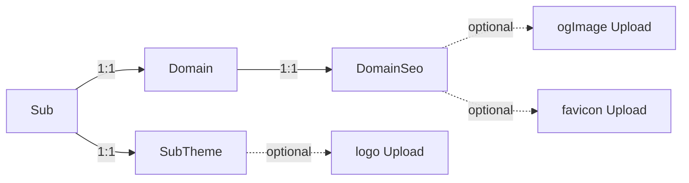

# Territory Branding (theme + domain SEO)

Lets a territory owner customize the look of their territory. The feature is split along two independent axes that the schema, cache, and React tree all model separately:

- **`SubTheme`** — the territory's *visual identity* (colors, logo, default color mode). Today still gated by an active custom domain at the consumer (`useSubTheme` returns `null` without one), but the row is keyed by `subName` and the data is staged everywhere it would need to live for "theme on every sub" to be a one-line change.
- **`DomainSeo`** — how the *custom domain* presents itself externally (page title, tagline, og:image, favicon). Permanently gated by an active custom domain because these settings only make sense when the territory *is* the site. On `stacker.news/~mysub` the page is SN's, so SN's title / og / favicon win.

The two pieces are server-rendered into the very first byte the browser receives, so there is no flash of unbranded content.

The feature is also gated behind beta access: the `upsertSubTheme` and `upsertDomainSeo` mutations are restricted to user IDs in `DOMAIN_BETA_IDS`.

---

## Why the split

Originally one `SubBranding` row carried *both* concerns. The leak: dropping the custom-domain gate to ship "theme on every sub" would also start replacing `<title>` / `<meta description>` / `og:site_name` on `stacker.news/~mysub`, silently hijacking SN's brand SEO from sub owners. The two concerns must therefore be gated independently, so they live in two rows.

| Concept | Scope it can ever live in |
|---|---|
| **SubTheme** | Anywhere the sub is in scope (`stacker.news/~mysub` *or* `mysub.com`). |
| **DomainSeo** | Only when the sub *is* the entire site (active custom domain). |

Schema shape:



Why these keys:

- **`SubTheme.subName`** (FK to `Sub`, `ON DELETE CASCADE`) survives a territory transfer, just like the territory itself.
- **`DomainSeo.domainId`** (FK to `Domain`, `ON DELETE CASCADE`) cleanly disappears with the domain. There is no orphan-SEO state.

Favicon goes in `DomainSeo` (not `SubTheme`) because the tab icon is part of "this is a standalone site": on `stacker.news/~mysub` the favicon should still be SN's; only on `mysub.com` does the territory's favicon make sense.

---

## End-to-end request flow

```
Browser  ─►  proxy.js  ─►  Next.js  ─►  Document.getInitialProps
                                              │
                                              ▼
                                  resolveHeadDataForRequest(req.host)
                                              │
                                              ▼
                                  getDomainMapping(host)
                                              │
                              ┌───────────────┴────────────────┐
                              ▼                                ▼
                          mapping (with               getSubTheme(subName)
                          inline seo fields)          (per-sub theme cache)
                              │                                │
                              ▼                                ▼
                       seo (title, tagline,             theme (colors, logo,
                       ogImageId, faviconId)            defaultMode)
                              │                                │
            ┌─────────────────┴────────┐         ┌─────────────┴───────────────┐
            ▼                          ▼         ▼                             ▼
  <link rel=icon>          <meta og:*/og:site_name>  <style id=sn-branding-theme>  <link rel=preload as=image>
  favicon hot in tab       social previews                buildBrandingCss(theme)        logo hot in cache
                                                          inline at <head>
                                                          data-sn-default-mode on <html>
```

By the time the browser reaches `<body>` it has:

1. **Resolved the brand favicon** (from SEO) so the tab icon never blinks.
2. **Loaded the inline `<style>`** (from theme) so `--bs-primary`, `--bs-primary-rgb`, `--theme-brandColor`, `--theme-link` are populated in the cascade.
3. **Run the existing `beforeInteractive` dark-mode script**, which now also reads `data-sn-default-mode`, so `data-bs-theme` is set on `<html>` *before* layout.
4. **Loaded the global stylesheet**, where every `var(--bs-primary)` reference resolves to the brand color on first paint.

### Dual-mode CSS targeting

The override block targets `:root`, `[data-bs-theme=light]`, and `[data-bs-theme=dark]` simultaneously, so whichever mode the inline `dark-mode-js` script picks, the brand colors are already active there. We compute the `*-rgb` triplet server-side from the hex (`lib/color.js`) because Bootstrap utility classes do `rgba(var(--bs-primary-rgb), .5)`. Overriding only the hex would silently break translucent variants.

### Default color mode resolution

```
localStorage.darkMode      → user already toggled, always wins
data-sn-default-mode       → owner default for first-time visitors
prefers-color-scheme       → OS default fallback
```

Once the user toggles, their localStorage choice wins forever.

---

## Files, by layer

### 1. Data model

#### `prisma/schema.prisma`

- **`SubTheme`** (1:1 with `Sub`, keyed by `subName`): `primaryColor`, `secondaryColor`, `linkColor`, `brandColor`, `logoId` (FK to `Upload`, `ON DELETE SET NULL`), `defaultMode` (`ThemeMode` enum). Cascade-delete on sub.
- **`DomainSeo`** (1:1 with `Domain`, keyed by `domainId`): `title`, `tagline`, `ogImageId`, `faviconId` (both FKs to `Upload`, `ON DELETE SET NULL`). Cascade-delete on domain.
- **`Sub.theme: SubTheme?`** and **`Domain.seo: DomainSeo?`** relations.
- `Upload` back-relations: `subThemeLogos`, `domainSeoOgImages`, `domainSeoFavicons`.

#### `prisma/migrations/20260502170000_sub_theme_and_domain_seo/migration.sql`

Creates the `ThemeMode` enum, the `SubTheme` table (PK `subName`, indexed `logoId`, FKs to `Sub` and `Upload`), and the `DomainSeo` table (PK `domainId`, indexed `ogImageId`/`faviconId`, FKs to `Domain` and `Upload`).

---

### 2. Server-side helpers

#### `lib/color.js`

Validates hex colors (`#rgb`, `#rgba`, `#rrggbb`, `#rrggbbaa`), normalizes them to canonical lowercase 7-char form, and converts to an `r, g, b` triplet. Bootstrap 5 utility classes consume both `--bs-primary` and `--bs-primary-rgb` (e.g. `rgba(var(--bs-primary-rgb), .5)`), so we must derive both from a single hex input on the server, otherwise translucent variants silently break.

#### `lib/branding-css.js`

Turns a `theme` object into a single CSS string that overrides `--bs-primary`, `--bs-primary-rgb`, `--bs-secondary`, `--bs-secondary-rgb`, `--theme-link`, `--theme-linkHover`, `--theme-brandColor`. Returns `null` when no overrides are valid. Targets `:root, [data-bs-theme=light], [data-bs-theme=dark]` (with doubled selectors for higher specificity) so the override wins regardless of which mode the boot script picks.

#### `lib/domains/index.js`

- `domainsMappingsCache` (single key, full active-domains map) carries `id`, `domainName`, `subName`, `tokenVersion`, **and an inline `seo` object** (`{ title, tagline, ogImageId, faviconId }`). Middleware never reads the SEO fields; it only needs the routing/auth data. Embedding SEO here means SSR resolves it without a second cache lookup.
- `subThemeCache` (keyed by `sub_theme:${subName.toLowerCase()}`) holds only theme fields: `primaryColor`, `secondaryColor`, `linkColor`, `brandColor`, `defaultMode`, `logoId`.
- `getDomainMapping(host)` → `{ id, domainName, subName, tokenVersion, seo }` or `null`.
- `getSubTheme(subName)` → theme row or `null`.
- `getDomainSeoForHost(host)` → composes mapping → returns `mapping?.seo ?? null` (no extra DB hit).

#### `lib/validate.js`

- `subThemeSchema`: hex colors, `logoId` positive int, `defaultMode` enum.
- `domainSeoSchema`: `title` ≤ 80, `tagline` ≤ 200, `ogImageId`/`faviconId` positive ints.

Both schemas are reused on the client (Formik `Form` validation) and the server (`upsertSubTheme` / `upsertDomainSeo`), so the rules can't drift.

---

### 3. GraphQL API

#### `api/typeDefs/sub.js`

- `enum ThemeMode { LIGHT DARK SYSTEM }`.
- `type SubTheme` + `input SubThemeInput` (theme fields).
- `type DomainSeo` + `input DomainSeoInput` (SEO fields).
- `Sub.theme: SubTheme` and `Sub.domainSeo: DomainSeo` field accessors.
- Mutations: `upsertSubTheme(subName, input)` and `upsertDomainSeo(subName, input)`.

#### `api/resolvers/sub.js`

- `assertSubOwnedByMe({ subName, me, models })`: shared auth + beta gate + ownership check used by both mutations.
- `assertUploadsOwnedByMe({ ids, me, models })`: shared upload-ownership check.
- `upsertSubTheme`: validates with `subThemeSchema`, checks `logoId` ownership, upserts on `subName`.
- `upsertDomainSeo`: requires the sub to have a `Domain` row (errors with `SEO settings require a custom domain`), validates with `domainSeoSchema`, checks `ogImageId`/`faviconId` ownership, upserts on `domainId`.
- `Sub.theme` / `Sub.domainSeo` field resolvers prefer SSR-loaded values, otherwise look up.

#### `fragments/subs.js`

- `SUB_THEME_FIELDS` fragment + `SUB_THEME` query + `UPSERT_SUB_THEME` mutation.
- `DOMAIN_SEO_FIELDS` fragment + `DOMAIN_SEO` query + `UPSERT_DOMAIN_SEO` mutation.

---

### 4. SSR / first-paint

#### `api/ssrApollo.js`

`getGetServerSideProps` exposes three independent props: `domain`, `theme`, `seo`. The React tree wires them through their own contexts (`DomainContext` / `SubThemeContext` / `DomainSeoContext`). Theme is still gated by an active mapping at this layer (`theme = domain ? await getSubTheme(domain.subName) : null`), but only as a *performance* gate. The presentation gate ("does this take visual effect?") lives in the React tree (`useSubTheme`, `useDomainSeo`).

#### `pages/_document.js`

This is the heart of the no-FOUC story.

- `resolveHeadDataForRequest(req)` awaits `getDomainMapping(host)` then `getSubTheme(domain.subName)`, returning `{ theme, seo }`. Errors are swallowed so a head-data blip can never crash a page render.
- **Render time:**
  - Theme drives: inline `<style id="sn-branding-theme">` (via `buildBrandingCss(theme)`), `<link rel="preload" as="image">` for the logo, `data-sn-default-mode="LIGHT|DARK|SYSTEM"` on `<html>`.
  - SEO drives: `<link rel="icon">` for the brand favicon, `<meta property="og:image">`, `<meta property="og:site_name">`.
- The inline `dark-mode-js` boot script consults `data-sn-default-mode` *before* `prefers-color-scheme`.

`_document.js` is the *only* point where Next.js lets us inject content above `<body>` synchronously, on the server, before React hydrates. The inline `<style>` and inline `<script>` reuse the existing CSP nonce, so we don't need to relax CSP for this feature. We deliberately don't render `<title>` or `<meta description>` here; those depend on the route and are handled by `Seo` (next section).

---

### 5. Client components

#### `components/territory-theme.js` (new)

- `SubThemeContext` + `SubThemeProvider`: hydrate from the `theme` SSR prop and stay in sync across `nodata` re-navigations.
- `useSubTheme()`: reads context, gates on `useDomain()`. Returns `null` whenever there's no active custom-domain mapping. **Drop the gate here AND in `api/ssrApollo.js` to roll theming out to every sub.**
- `TerritoryThemeForm`: editor for colors, logo, default mode. Pre-fills from the `SUB_THEME` query, validates with `subThemeSchema`, posts via `UPSERT_SUB_THEME`. Color inputs treat the empty/black-default value as "use SN default" and send `null` to the server, so the SCSS defaults shine through instead of locking the page to `#000000`.

#### `components/domain-seo.js` (new)

- `DomainSeoContext` + `DomainSeoProvider`: same shape as the theme provider.
- `useDomainSeo()`: reads context, gates on `useDomain()` *permanently*. SEO is meaningless without an active custom domain.
- `TerritoryDomainSeoForm`: editor for title, tagline, social preview, favicon. Pre-fills from the `DOMAIN_SEO` query, validates with `domainSeoSchema`, posts via `UPSERT_DOMAIN_SEO`. When the sub has no `Domain` row, the form renders disabled with an info banner explaining the dependency. The server-side mutation also rejects this case as a defense-in-depth.

#### `pages/_app.js`

Provider tree: `DomainProvider` → `SubThemeProvider theme={theme}` → `DomainSeoProvider seo={seo}` → `MeProvider`.

#### `components/territory-domains.js`

Owns `DomainProvider`, `useDomain`, `usePrefix`, `useNavKeys`, and `CustomDomainForm`. Pure custom-domain plumbing.

#### `components/territory-form.js`

Inside the "advanced" accordion (which itself is gated by `DOMAIN_BETA_IDS` on stacker.news only), renders three sibling accordion entries:

- `<TerritoryDomains sub={sub} />` (custom domain setup)
- "appearance" → `<TerritoryThemeForm sub={sub} />`
- "domain SEO" → `<TerritoryDomainSeoForm sub={sub} />`

Each form has its own `<Form>` and its own `SubmitButton`, so saves are independent.

#### `components/nav/common.js` (`Brand`)

Reads `useSubTheme()`. When a logo is set, renders ``; the SSR head already preloaded that exact URL, so the image is in cache by the time the nav mounts.

#### `components/favicon.js`

Reads `useDomainSeo()`. If a brand favicon is set, it replaces the *default* favicon slot only. Notification favicons (new comments / new notes) still win, because notifications communicate state the user needs to see.

#### `components/seo.js`

Reads `useDomainSeo()` and swaps "stacker news" for `seo.title` in `<title>` and `og:site_name`. Uses `seo.tagline` as the meta description on non-item pages. For non-item pages, prefers `seo.ogImage` over the `capture.stacker.news` screenshot. Item pages always use capture, since per-item screenshots show the actual content.

#### `components/dark-mode.js`

The `getTheme` function consults `document.documentElement.dataset.snDefaultMode` between localStorage and `prefers-color-scheme`. Mirrors the `_document.js` boot script (the script runs `beforeInteractive` for first paint; the React hook runs after hydration; both must agree on the algorithm or the theme would flip on hydration).

---

## Caching summary

| Cache | Key | Holds | Used by |
|-------|-----|-------|---------|
| `domainsMappingsCache` | `'domain_mappings'` (single key, full table) | All `ACTIVE` mappings: `domainName`, `subName`, `id`, `tokenVersion`, **inline `seo`** (`title`, `tagline`, `ogImageId`, `faviconId`) | Middleware (mapping fields), SSR `_document.js` + `getServerSideProps` (mapping + seo) |
| `subThemeCache` | `sub_theme:${subName.toLowerCase()}` | Single theme row | SSR `_document.js`, `getServerSideProps` |

In production each Next.js instance has its own in-memory cache, so changes propagate by TTL rather than mutation-time invalidation. The toast on save warns owners: *"... saved, may take a few minutes to take effect"*.

---

## Edge cases & guardrails

- **Theme without a custom domain** is persisted but inert today (`useSubTheme` gates on `useDomain()`). Drop the gate to ship theme on every sub.
- **SEO without a custom domain** errors at the mutation; the editor disables the submit button and shows an info banner.
- **Invalid hex** is dropped server-side (validated by `subThemeSchema`, normalized by `normalizeHexColor`). The empty override means the page renders vanilla SN colors, never broken CSS.
- **Image safety:** logo / favicon / og:image upload through the existing presigned-POST flow with `avatar:true`, which enforces image-only MIME types and a 5MB cap.
- **Owner-only mutations:** `upsertSubTheme` and `upsertDomainSeo` enforce the same beta gate plus `sub.userId === me.id` check as `setDomain`.
- **Asset ownership:** both mutations reject upload IDs the caller doesn't own.
- **CSP:** the inline `<style>` and inline scripts both pick up the existing CSP nonce.
- **Hydration mismatch:** SSR (`_document.js`, `getGetServerSideProps`) and the React tree (`useSubTheme`, `useDomainSeo`) all gate through the same active-domain check, so server and client agree. Server-side head tags use `MEDIA_URL`; browser consumers use `PUBLIC_MEDIA_URL`. Same value in prod, different inside Docker.
- **Territory takeover:** theme is intentionally preserved (the territory's identity, not the owner's). SEO is tied to the domain row, so it disappears if the domain is removed and reconfigured.

---

## Touchpoints (quick index)

| Layer | File | Role |
|-------|------|------|
| Schema | `prisma/schema.prisma`, `prisma/migrations/20260502170000_sub_theme_and_domain_seo/migration.sql` | `SubTheme` + `DomainSeo` models, `ThemeMode` enum |
| Cache | `lib/domains/index.js` | `domainsMappingsCache` (with inline seo), `subThemeCache`, `getSubTheme`, `getDomainSeoForHost` |
| Helpers | `lib/color.js`, `lib/branding-css.js` | hex parsing, CSS variable builder |
| Constants | `lib/constants.js` | `PUBLIC_MEDIA_URL` split |
| Validation | `lib/validate.js` | `subThemeSchema`, `domainSeoSchema` |
| GraphQL | `api/typeDefs/sub.js`, `api/resolvers/sub.js`, `fragments/subs.js` | types, mutations, field resolvers, fragments |
| SSR plumbing | `api/ssrApollo.js`, `pages/_document.js` | inject theme/seo into context, emit head tags |
| Boot script | `pages/_document.js`, `components/dark-mode.js` | default-mode wiring |
| React contexts + hooks | `components/territory-theme.js`, `components/domain-seo.js` | `SubThemeProvider`/`useSubTheme`, `DomainSeoProvider`/`useDomainSeo` |
| Consumers | `components/nav/common.js` (theme), `components/favicon.js` (seo), `components/seo.js` (seo) | logo / favicon / OG / `<title>` |
| Editor UI | `components/territory-theme.js`, `components/domain-seo.js`, `components/territory-form.js` | `TerritoryThemeForm`, `TerritoryDomainSeoForm`, mounted in advanced settings |
| Docs | `docs/dev/custom-domains.md` (this file's sibling) | per-territory branding section |
